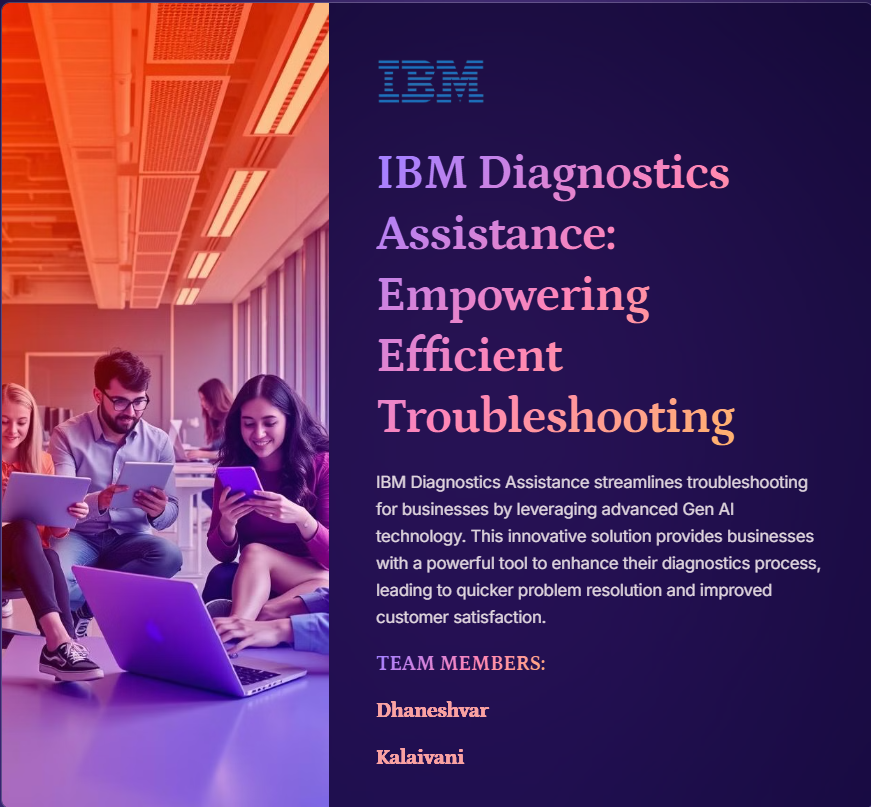
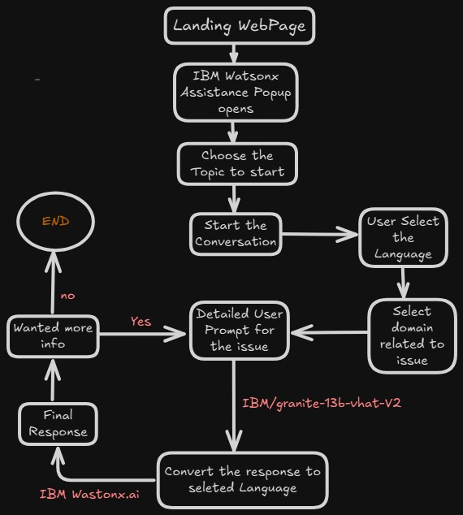
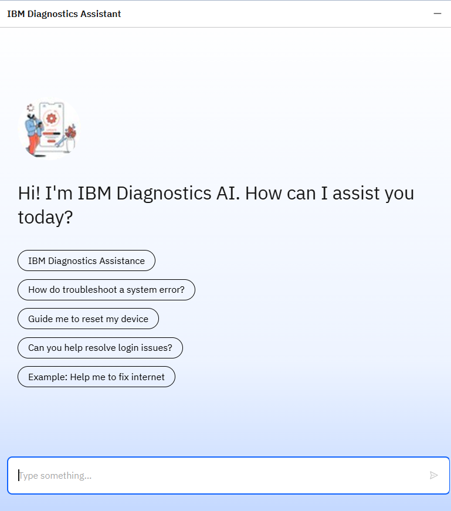

### IBM-Diagnostics-Gen-AI-Assistant

## Problem Statement

 
    Support teams often struggle to manage increasing customer queries, leading to delayed responses and incorrect issue resolutions. IBM Diagnostics Gen AI Assistant addresses this challenge by automating troubleshooting processes, enabling faster and more accurate solutions. The system analyzes queries, identifies root causes, and suggests solutions, reducing manual intervention and increasing efficiency. This automation allows support teams to handle larger volumes of issues, scale operations, and improve overall response times. Ultimately, IBM's AI Assistant enhances customer satisfaction by ensuring issues are resolved quickly and correctly, leading to a more streamlined and effective support experience.

##  Category tags:

    Customer Support

## 📝 IBM-Diagnostics-Gen-AI-Assistant  Features 💡
    -   Multilingual Support
    -   Website Application
    -   Intuitive Interface
    -   Personalized Assistance

## 👨🏻‍💻 Technical Stack
    -   IBM Wastonx Assistance
    -   Wastonx.ai (Gen AI)
           IBM/granite-13b-chat-v2
    -   IBM cloud
    -   IBM Extension
    -   No Code Platform

## 📚 Languages
    -   Python
    -   Markdown

## </> Path to check Artifacts File
    -   ./Artifacts/
    -   IBM-Diagnostics-Assistance-Empowering-Efficient-Troubleshooting.pdf
    -   IBM Diagnostics Assistance_Arch_Diag.png

# 📐 Our IBM-Diagnostics-Gen-AI-Assistant - Architecture Diagram

#

# 🔗 To Connect with Us:

### Dhaneshvar

### Kalaivani

# 🎥 Check out the Site Link Here

## 💼 Working :
    -   Click above link to open the site
    -   After few seconds, you will see chatPopup open, appears, click that
    -   start the conversion upon click on IBM Diagnostics Assistance session
    -   Then continue the conversation

